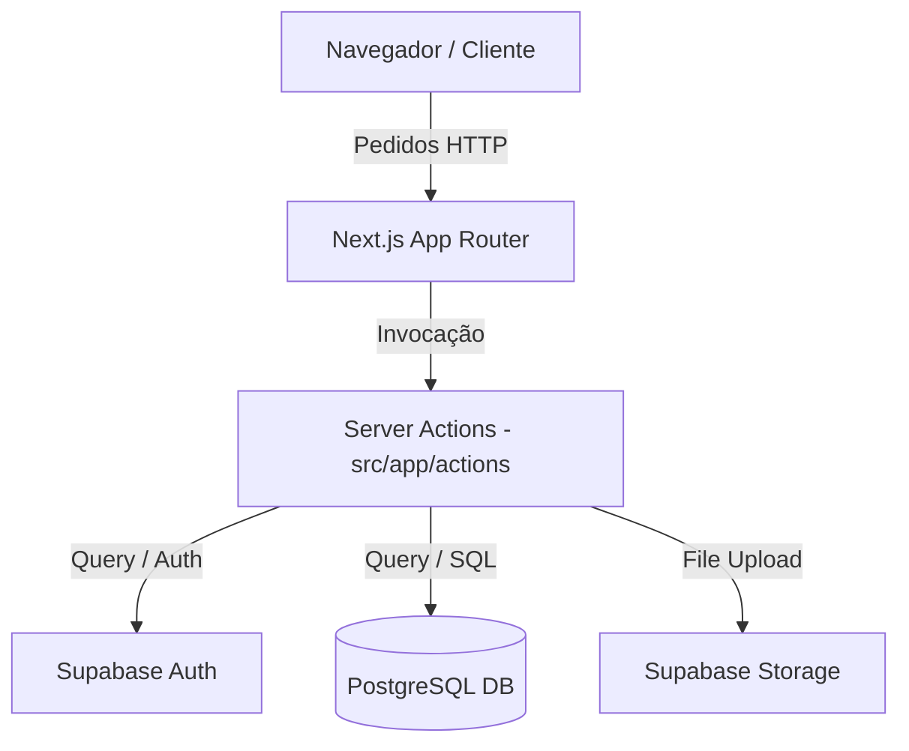

# Documentação Técnica - Gestão Flex

Este documento fornece uma visão geral técnica do sistema **Gestão Flex**, um SaaS de Microcrédito.

## 1. Visão Geral da Arquitetura

O sistema segue uma arquitetura moderna baseada em Next.js e Supabase.

- **Framework**: [Next.js 16](https://nextjs.org/) (App Router).
- **Linguagem**: [TypeScript](https://www.typescriptlang.org/).
- **Banco de Dados & Autenticação**: [Supabase](https://supabase.com/).
- **Estilização**: [Tailwind CSS](https://tailwindcss.com/) + [Radix UI](https://www.radix-ui.com/).

### Fluxo de Dados

## 2. Modelo de Dados (Principais Tabelas)

### Core Business
- `institutions`: Empresas (tenants) que utilizam o software.
- `users`: Perfis de usuário vinculados a uma instituição.
- `clients`: Clientes finais que solicitam empréstimos.
- `loans`: Registros de empréstimos, taxas de juro e prazos.
- `installments`: Parcelas geradas para cada empréstimo.

### Financeiro
- `accounts`: Contas (Caixas) de cada instituição para movimentação de valores.
- `transactions`: Log de débitos e créditos (entradas/saídas) financeiras.
- `payments`: Registro de pagamentos efetuados pelos clientes.

### Auditoria e Segurança
- `operation_logs`: Log imutável de operações administrativas (Empréstimos, Pagamentos, Cancelamentos).
- `roles`: Definição de permissões (admin_geral, gestor, admin, operador).

## 3. Fluxos Principais

### Criação de Empréstimo
1. O usuário preenche o formulário com dados do cliente e condições.
2. A **Server Action** `createLoanAction`:
   - Verifica saldo na conta selecionada.
   - Cria o registro em `loans`.
   - Gera as parcelas em `installments`.
   - Cria uma transação de débito em `transactions`.
   - Atualiza o saldo da conta em `accounts`.
   - Registra a operação em `operation_logs`.

### Pagamento de Parcela
1. O usuário marca uma parcela como paga.
2. A **Server Action** `payInstallmentAction`:
   - Atualiza o status da parcela.
   - Cria o registro em `payments`.
   - Cria uma transação de crédito em `transactions`.
   - Atualiza o saldo da conta.
   - Verifica se todas as parcelas foram pagas para concluir o empréstimo.

## 4. Segurança (RLS)

O sistema utiliza **Row Level Security (RLS)** do PostgreSQL para garantir que:
- Usuários de uma instituição nunca vejam dados de outra.
- A função `public.user_institution_id()` é usada nas políticas para filtrar registros pelo `institution_id` do usuário logado.

## 5. Convenções de Código

- **Server Actions**: Localizadas em `@/app/actions`. Devem sempre retornar um objeto `{ success: boolean, data?: any, error?: string }`.
- **Componentes UI**: Baseados em Shadcn/UI, localizados em `@/components/ui`.
- **Utilidades**: Funções puras em `@/lib` e helpers do Supabase em `@/utils/supabase`.
