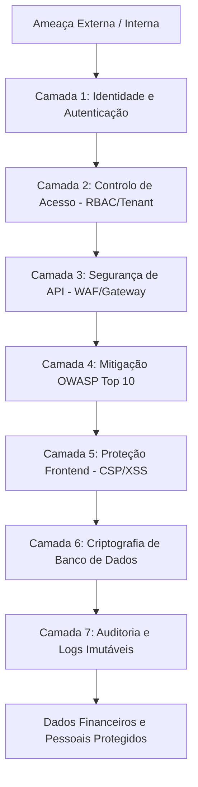
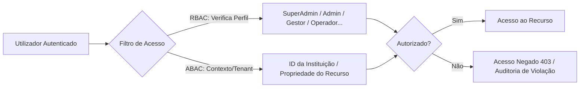
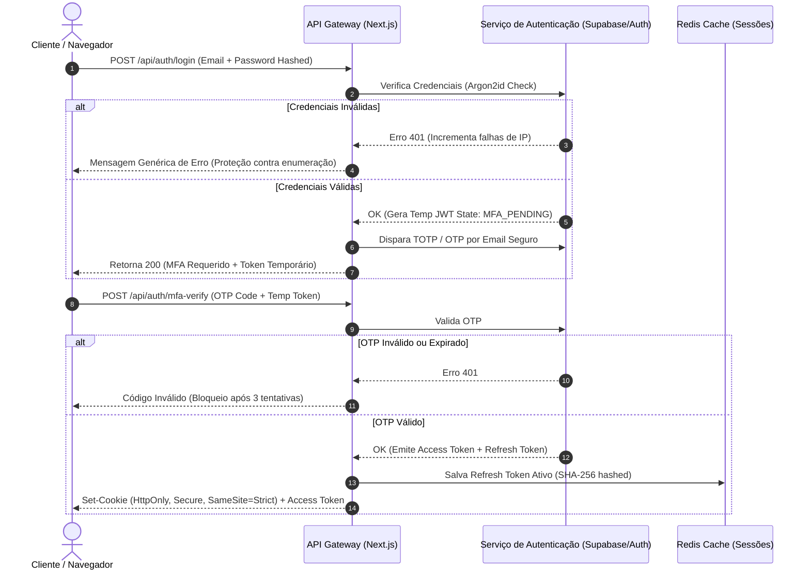
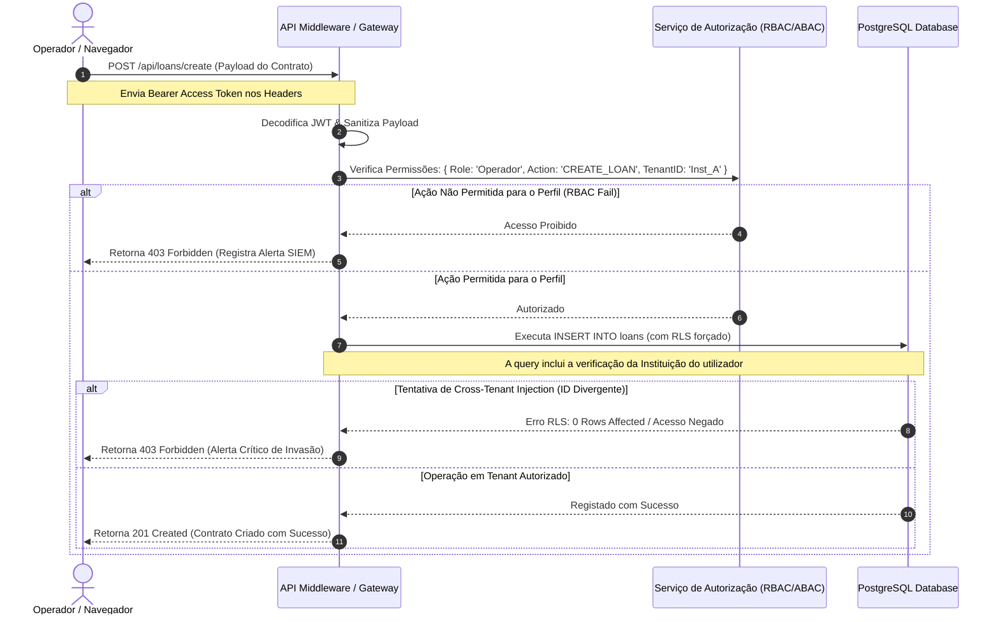

# Arquitetura de Segurança de Nível Empresarial (Enterprise Grade) - GestãoFlex
**Documento de Especificação Técnica e Design Arquitetural**
*Autor: Arquiteto de Segurança Sênior & Especialista em Cibersegurança*
*Status: Aprovado para Implementação (Secure-by-Design)*

---

## 1. Visão Geral e Princípios Fundamentais

A arquitetura de segurança do **GestãoFlex** foi projetada com base no modelo **Zero Trust** ("Nunca confiar, sempre verificar") e no princípio de **Defense in Depth** (Segurança em Camadas). Como uma plataforma SaaS de gestão financeira e microcrédito que manipula dados extremamente sensíveis, a proteção da confidencialidade, integridade e disponibilidade (Tríade CID) é o núcleo do nosso design de engenharia.



---

## 2. Detalhamento Técnico das 12 Camadas de Segurança

### CAMADA 1 – AUTENTICAÇÃO E IDENTIDADE

A autenticação é a primeira linha de defesa. Implementamos um fluxo criptograficamente robusto baseado em tokens e múltiplos fatores.

*   **Autenticação JWT Criptográfica**:
    *   **Access Token**: JWT de curta duração (15 minutos), assinado com `RS256` (par de chaves pública/privada para evitar vazamentos de chaves simétricas no backend), contendo declarações (claims) não sensíveis (`sub`, `iss`, `aud`, `exp`, `role`, `tenant_id`).
    *   **Refresh Token Rotativo (RTR - Refresh Token Rotation)**: Armazenado em banco de dados de alta performance (Redis), persistido com Hash criptográfico SHA-256. Sempre que um Access Token é renovado, o Refresh Token anterior é invalidado e um novo é emitido. Se um Refresh Token antigo for reutilizado, detecta-se um potencial ataque de interceptação, invalidando imediatamente toda a árvore de sessões daquele utilizador.
*   **MFA (Autenticação Multifator) & OTP**:
    *   **Fluxo de Login de Duas Etapas (2FA)**: Login inicial (email/senha) gera um estado temporário `MFA_PENDING`.
    *   **OTP (One-Time Password) por Email/App (TOTP)**: Envio de código numérico gerado por HMAC-SHA1 de 6 dígitos baseado em tempo (TOTP - RFC 6238) ou canal seguro. O token expira estritamente em 5 minutos e só pode ser verificado uma única vez.
*   **Gestão Segura de Senhas (Argon2id)**:
    *   As senhas dos utilizadores são criptografadas com **Argon2id** (v=19, m=65536, t=3, p=4), o algoritmo vencedor do *Password Hashing Competition*, oferecendo resistência superior a ataques baseados em GPU/ASIC.
    *   Um **Salt criptográfico de 16 bytes único e gerado aleatoriamente** (`cryptographically secure pseudo-random number generator - CSPRNG`) é combinado com a senha antes do hashing.
*   **Proteção contra Brute Force e Credential Stuffing**:
    *   **Bloqueio Progressivo de Conta**: A conta é temporariamente suspensa por 15 minutos após 5 tentativas consecutivas de senha inválida.
    *   **Rate Limiting no endpoint `/auth/login`**: Restrição estrita de 5 requisições por minuto por endereço IP.

---

### CAMADA 2 – CONTROLO DE ACESSO (RBAC & MULTI-TENANCY)

O controlo de acesso segue rigorosamente o princípio do **Privilégio Mínimo** (Least Privilege) e a **Segregação de Funções** (SoD - Segregation of Duties).



*   **Isolamento Multi-tenant (Segregação Organizacional)**:
    *   Cada query ao banco de dados deve conter explicitamente a cláusula `institution_id = auth.uid().institution_id`.
    *   Implementação de **RLS (Row Level Security)** nativo na base de dados (PostgreSQL/Supabase) para atuar como uma salvaguarda definitiva, garantindo que mesmo se houver uma falha lógica no código da aplicação, a própria base de dados bloqueará o vazamento de dados inter-tenant.

#### Matriz de Perfis e Permissões (RBAC)

| Perfil | Descrição | Permissões Principais | Restrições Estritas |
| :--- | :--- | :--- | :--- |
| **Super Administrador** | Administrador da Plataforma SaaS | Gerir Planos, Criar/Suspender Instituições, Ver Logs do Sistema global. | **Não** pode visualizar dados financeiros internos das instituições. |
| **Administrador** | Administrador da Instituição | Gestão de utilizadores da instituição, configurações de faturamento, auditoria interna. | Não opera empréstimos ou aprovações diretamente (SoD). |
| **Gestor** | Gestor Operacional | Aprovar Empréstimos de alto valor, gerir carteiras de clientes, configurar taxas de juro. | Alterações em dados bancários globais da instituição. |
| **Financeiro** | Analista Financeiro | Lançar pagamentos, reconciliação bancária, emissão de relatórios fiscais e contábeis. | Não pode criar ou aprovar contratos de empréstimo. |
| **Operador** | Agente de Crédito / Atendimento | Registar Clientes, simular empréstimos, criar contratos sob aprovação. | **Não** pode aprovar contratos ou alterar taxas de juro/mora. |
| **Auditor** | Auditor Externo / Compliance | Acesso completo em modo **Apenas Leitura (Read-Only)** a todos os dados e logs da instituição. | Bloqueado para qualquer operação de escrita (INSERT/UPDATE/DELETE). |
| **Cliente** | Tomador de Crédito (Portal) | Visualizar os próprios contratos, consultar extrato de pagamentos, anexar documentos. | Isolado exclusivamente aos seus próprios registros pessoais. |

---

### CAMADA 3 – SEGURANÇA DE API

A camada de API funciona como o portão de entrada para todos os dados da plataforma.

*   **API Gateway & Rate Limiting**:
    *   Implementação de um limitador de taxa (Rate Limiter) dinâmico via Cloudflare e rotas da API (`up to 100 requests per minute per IP` para endpoints normais, e `10 requests per minute` para endpoints críticos).
    *   **Throttling**: Redução progressiva da velocidade de resposta para IPs que apresentem comportamento suspeito de scraping de dados.
*   **Validação Estrita de Entrada e Sanitização**:
    *   **Validação de Schema (Zod/JSON Schema)**: Nenhuma entrada é processada sem antes passar por um parser de tipagem estrita no backend. Todos os campos não mapeados são descartados automaticamente.
    *   **Sanitização de HTML contra Injeções**: Utilização de bibliotecas como `DOMPurify` ou `sanitize-html` para limpar strings de texto livre, mitigando XSS e SQL Injection.
*   **Proteção de Injeção Avançada**:
    *   **SQL/NoSQL**: Utilização exclusiva de queries parametrizadas (ORM / Prepared Statements). Sem concatenação de strings em queries em hipótese alguma.
    *   **Prompt Injection**: Se recursos de IA/LLM forem integrados para análise de crédito, as entradas passam por filtros sanitizadores de sistema baseados em *guardrails* estruturados.
*   **Headers de Segurança HTTP Obrigatórios**:
    ```http
    Strict-Transport-Security: max-age=63072000; includeSubDomains; preload
    X-Content-Type-Options: nosniff
    X-Frame-Options: DENY
    X-XSS-Protection: 1; mode=block
    Referrer-Policy: strict-origin-when-cross-origin
    Permissions-Policy: geolocation=(), microphone=(), camera=()
    ```

---

### CAMADA 4 – MITIGAÇÃO OWASP TOP 10 (ALINHADA COM ASVS L3)

Seguimos a especificação **OWASP ASVS (Application Security Verification Standard) Nível 3 (Avançado/Sistemas Críticos)**.

```
+-----------------------------------------------------------------------------------+
|                           OWASP TOP 10 MITIGATION CHART                           |
+------------------------------------+----------------------------------------------+
| A1: Broken Access Control          | RLS ativo em nível de Banco de Dados.        |
+------------------------------------+----------------------------------------------+
| A2: Cryptographic Failures         | AES-256-GCM para dados em trânsito e repouso.|
+------------------------------------+----------------------------------------------+
| A3: Injection                      | Prepared Statements e Schemas Zod Estritos.  |
+------------------------------------+----------------------------------------------+
| A4: Insecure Design                | Threat Modeling e SoD desde a fase de design.|
+------------------------------------+----------------------------------------------+
| A5: Security Misconfiguration      | Desativação de headers informativos de server|
+------------------------------------+----------------------------------------------+
| A6: Vulnerable Components          | Auditoria automatizada diária via Snyk/SCA.  |
+------------------------------------+----------------------------------------------+
| A7: Identification & Auth Failures | Argon2id + OTP/MFA + Rotação de Tokens.      |
+------------------------------------+----------------------------------------------+
| A8: Software & Data Integrity Fails| Assinatura digital de payloads e webhooks.   |
+------------------------------------+----------------------------------------------+
| A9: Security Logging & Monitoring  | Logs estruturados imutáveis enviados ao SIEM.|
+------------------------------------+----------------------------------------------+
| A10: SSRF                          | Validação estrita de URLs de saída de PDF/S3 |
+------------------------------------+----------------------------------------------+
```

---

### CAMADA 5 – PROTEÇÃO FRONTEND

O cliente web é protegido contra ataques que visam comprometer a sessão do utilizador.

*   **Política de Segurança de Conteúdo (CSP - Content Security Policy)**:
    *   Uma política estrita baseada em `nonce` que impede a execução de scripts em linha (inline scripts) não autorizados:
    ```http
    Content-Security-Policy: default-src 'self'; script-src 'self' 'nonce-rAnd0mKey'; style-src 'self' https://fonts.googleapis.com; img-src 'self' data: https://dhvujedotuiazbseughf.supabase.co; frame-ancestors 'none'; object-src 'none';
    ```
*   **Cookies de Sessão Seguros**:
    *   Os cookies contendo tokens de sessão recebem os seguintes atributos:
        *   `Secure`: Garante o tráfego estrito via HTTPS.
        *   `HttpOnly`: Impede o acesso ao cookie via JavaScript (`document.cookie`), mitigando roubo de sessão por XSS.
        *   `SameSite=Strict` ou `Lax`: Impede que o cookie seja enviado em requisições de origem cruzada, mitigando ataques de CSRF (Cross-Site Request Forgery).

---

### CAMADA 6 – SEGURANÇA E CRIPTOGRAFIA DE BANCO DE DADOS

Os dados em repouso e dados pessoais identificáveis (PII - Personally Identifiable Information) devem ser altamente protegidos.

*   **Criptografia AES-256 em Repouso**:
    *   Toda a infraestrutura de banco de dados (armazenamento físico) é criptografada nativamente usando AES-256.
*   **Criptografia de Nível de Coluna Aplicada (Application-Level Encryption)**:
    *   Dados extremamente críticos como Documentos de Identidade (BI), Números de Telefone, Emails de Clientes e Valores Contratuais sensíveis são criptografados antes de serem inseridos no banco de dados.
    *   **Algoritmo**: `AES-256-GCM` (Autenticado), garantindo a integridade dos dados criptografados.
    *   **Gestão de Chaves Separada (Segregação de Chaves)**: As chaves de criptografia/descriptografia são armazenadas fora do servidor do banco de dados, em um serviço de **KMS (Key Management Service)** dedicado (ex: AWS KMS ou Vault). O banco de dados nunca possui a chave que descriptografa os dados de forma legível.

```
[Aplicação (Next.js)] <--- Solicita Chave via IAM ---> [AWS KMS / Vault]
       |
       | (Descriptografa com AES-GCM em Memória)
       v
[Exibe Dado Legível no Frontend Seguro]
```

---

### CAMADA 7 – AUDITORIA E MONITORAMENTO (LOGS IMUTÁVEIS)

Toda atividade de escrita ou leitura de dados altamente sensíveis deve deixar uma trilha de auditoria à prova de adulterações.

*   **Logs Estruturados**:
    *   Cada log segue o formato estruturado JSON contendo: `timestamp`, `user_id`, `action`, `resource`, `ip_address`, `user_agent`, `status`, `tenant_id` e o hash do log anterior (`log chaining`) para assegurar integridade.
*   **Logs Imutáveis via Log Shipping**:
    *   Os logs gerados na aplicação são transmitidos de forma assíncrona para uma fila de processamento e gravados em um bucket S3 com política **WORM (Write Once, Read Many)** configurada, impedindo a exclusão ou alteração de logs por qualquer pessoa, incluindo administradores do sistema.
*   **Eventos Monitorados Obrigatoriamente**:
    *   `AUTH_LOGIN_SUCCESS` / `AUTH_LOGIN_FAILED` / `AUTH_LOGOUT`
    *   `LOAN_CREATE` / `LOAN_APPROVE` / `LOAN_DISBURSE`
    *   `PAYMENT_RECEIVE` / `RECONCILIATION_EXECUTE`
    *   `USER_ROLE_CHANGE` / `SECURITY_POLICY_UPDATE`

---

### CAMADA 8 – DETECÇÃO E PREVENÇÃO DE FRAUDES

O sistema possui uma inteligência integrada de monitoramento comportamental e detecção de anomalias (Fraud Detection).

*   **Detecção de Acessos Anormais**:
    *   **Geolocalização Impossível (Velocity Check)**: Se um utilizador realiza login em Maputo, Moçambique, e 20 minutos depois realiza uma ação a partir de Lisboa, Portugal, um alerta crítico de fraude é emitido e a sessão é imediatamente bloqueada.
    *   **Mudança Súbita de Padrão de Comportamento**: Se um operador que costuma movimentar até 50.000 MTn por dia tenta processar uma aprovação de 1.000.000 MTn em horários atípicos (ex: 3h da manhã), a operação é bloqueada e enviada para aprovação secundária do Gestor via fluxo **Double-Signature/Multi-Sig**.

---

### CAMADA 9 – SEGURANÇA CLOUD E INFRAESTRUTURA

A GestãoFlex opera em um ambiente de nuvem altamente seguro e resiliente.

```
       [ Usuário na Internet ]
                  │
                  ▼
         [ CDN + WAF + DDoS ] (Cloudflare Enterprise)
                  │
                  ▼
         [ Gateway / Firewall ] (Bloqueia tudo exceto IPs autorizados)
                  │
                  ▼
     ┌────────────┴────────────┐
     ▼                         ▼
[Ambiente Homologação]   [Ambiente Produção] (ISOLADO)
     │                         │
     ▼                         ▼
[Base de Dados Homol]    [Base de Dados Prod]
```

*   **Segregação Estrita de Ambientes**:
    *   Os ambientes de Desenvolvimento, Homologação e Produção residem em contas AWS/Supabase completamente separadas e sem comunicações cruzadas. Os dados de produção nunca são utilizados em desenvolvimento.
*   **WAF (Web Application Firewall) & DDoS Shield**:
    *   Cloudflare Enterprise ativa para mitigação de ataques volumétricos de DDoS (Camada 3, 4 e 7) e filtros de assinatura de WAF para barrar ataques de injeção comuns antes que cheguem aos servidores de aplicação.
*   **Rede Privada Virtual (VPC)**:
    *   Os servidores de banco de dados e APIs privadas rodam dentro de subredes estritamente privadas, sem endereços IP públicos expostos, acessíveis apenas através de um gateway seguro / bastion host com VPN IPsec obrigatória.

---

### CAMADA 10 – PIPELINE DEVSECOPS

A segurança é integrada desde a primeira linha de código, automatizando a validação em todas as fases do CI/CD.

```
[Git Commit] ──► [SAST (Semgrep)] ──► [SCA (Audit/Snyk)] ──► [Secret Scanning] ──► [Dynamic DAST] ──► [Gate: Pass?] ──► [Deploy Prod]
```

*   **SAST (Static Application Security Testing)**:
    *   Análise estática contínua do código-fonte em cada Pull Request via `Semgrep` ou `SonarQube` para detetar más práticas e vulnerabilidades de código de forma precoce.
*   **SCA (Software Composition Analysis) / Dependency Scanning**:
    *   Auditoria automática de dependências (npm, node_modules) via `Snyk` ou `npm audit` para bloquear o build se pacotes contendo CVEs críticas conhecidas forem identificados.
*   **Secret Scanning**:
    *   Varredura de repositórios via `Gitleaks` integrada nos hooks do Git para garantir que nenhuma chave privada, token ou credencial seja acidentalmente comitada.
*   **Security Gates**:
    *   Regras estritas no GitHub Actions/GitLab CI: Deploys são automaticamente cancelados se houver qualquer vulnerabilidade classificada como "High" ou "Critical".

---

### CAMADA 11 – COMPLIANCE, PRIVACIDADE E REGULAMENTAÇÃO

A GestãoFlex é desenhada para estar em conformidade total com as leis globais e locais de proteção de dados (como a **Lei de Proteção de Dados de Moçambique**, **LGPD** e **GDPR**).

*   **Consentimento Explícito (Privacy by Design)**:
    *   Termos de uso e políticas de privacidade com aceitação granular no momento do cadastro do cliente final.
*   **Direito de Exclusão (Direito ao Esquecimento - Right to be Forgotten)**:
    *   Fluxo automatizado e auditável que permite a anonimização de dados do cliente (substituição do nome e dados por strings aleatórias criptográficas) após o período legal obrigatório de retenção financeira ter expirado (normalmente 5 a 10 anos sob regulamentos do Banco Central).
*   **Retenção e Portabilidade**:
    *   Exportação completa dos dados cadastrais do cliente em formato legível estruturado (JSON/CSV) mediante autenticação forte e duplo fator de segurança.

---

### CAMADA 12 – RECUPERAÇÃO DE DESASTRES E CONTINUIDADE (DR/BCP)

Garantia de resiliência e alta disponibilidade contra eventos catastróficos.

*   **Estratégia de Backups Criptografados**:
    *   Backups diários incrementais e backups semanais completos automatizados via instantâneos do banco (snapshots) criptografados com chave `AES-256` dedicada.
    *   **Versionamento e Imutabilidade de Backups**: Backups replicados de forma assíncrona para uma região geográfica secundária (Cross-Region Replication), com bloqueio de exclusão por 30 dias para proteção contra Ransomware.
*   **RTO e RPO Clássicos de Classe Financeira**:
    *   **RPO (Recovery Point Objective)**: Máximo de 1 hora de perda de dados.
    *   **RTO (Recovery Time Objective)**: Máximo de 15 minutos para restauração total dos serviços através de failover automatizado para região espelhada (Active-Passive multi-region hot-standby).

---

## 3. Fluxo de Autenticação Seguro (Sequence Diagram)

O diagrama abaixo ilustra o fluxo completo de autenticação, desde a verificação inicial até a validação do MFA (OTP) e emissão de tokens rotativos.



---

## 4. Fluxo de Autorização Seguro (Sequence Diagram)

O diagrama detalha como a aplicação valida se uma operação cumpre tanto o RBAC (Função do utilizador) quanto o isolamento de dados do Tenant antes de permitir a escrita.



---

## 5. Estratégia de Criptografia de Dados (Matriz de Chaves e Algoritmos)

| Dado / Recurso | Algoritmo Utilizado | Gestão de Chaves | Frequência de Rotação |
| :--- | :--- | :--- | :--- |
| **Senhas de Acesso** | Argon2id (m=65536, t=3, p=4) | Salt Criptográfico de 16 bytes único gerado via CSPRNG | Não aplicável (Hashed de via única) |
| **Tokens de Acesso JWT** | RS256 (RSA Signature com SHA-256) | Chave Privada em HSM e Chave Pública exposta para validação | Anual / Emergencial |
| **Dados Pessoais (Emails, BI, NIF, Fone)** | AES-256-GCM (Criptografia de Coluna) | Chave Gerada e Armazenada no AWS KMS/Vault | Semestral automatizada |
| **Dados em Trânsito (Rede)** | TLS 1.3 (Mínimo TLS 1.2 suportado) | Certificados Geridos pela Autoridade de Certificação (Let's Encrypt / AWS ACM) | A cada 90 dias (Renovação automática) |
| **Backups do Banco** | AES-256 (Criptografia nativa em repouso) | AWS KMS Master Key | Anual |

---

## 6. Dashboard de Auditoria e Segurança (Design Arquitetural do SIEM)

A arquitetura do painel de monitoramento do Administrador de Segurança é desenhada para oferecer observabilidade em tempo real dos eventos da plataforma GestãoFlex.

```
┌──────────────────────────────────────────────────────────────────────────────────┐
│ GESTÃOFLEX SECURITY COCKPIT & SIEM DASHBOARD                                     │
├───────────────────────┬──────────────────────────────────┬───────────────────────┤
│ EVENTOS DE ACESSO     │ ALERTAS DE SEGURANÇA ATIVOS      │ INFRA E PIPELINE      │
│  [99.8%] Logins Ok    │  [⚠️ 02] Tentativas de Brute Force│  [WAF] Cloudflare: Ok │
│  [0.2%] Falhas OTP    │  [❌ 00] Acesso Cross-Tenant     │  [SAST] Semgrep: 0 Bgs│
│                       │  [⚠️ 01] Login de Geo Incomum    │  [DAST] Snyk: 0 Vuln  │
├───────────────────────┴──────────────────────────────────┴───────────────────────┤
│ ÚLTIMOS LOGS DE AUDITORIA (STREAMING EM TEMPO REAL)                              │
│  18:55:04 - canija@jose.com - SUCCESS_LOGIN - IP: 41.220.201.179 - OTP_Verified  │
│  18:55:10 - operador@cred.com - LOAN_CREATE - ID: 88f2 - Tenant: Inst_A          │
│  18:55:14 - sys_cron - SUBSCRIPTION_RECOVERY - Updated 11 rows - Success         │
└──────────────────────────────────────────────────────────────────────────────────┘
```

---

## 7. Checklist Final de Segurança Empresarial (Go-Live Ready)

Antes de mover a plataforma GestãoFlex para o ambiente de produção, este checklist estrito deve ser assinado eletronicamente pelo CISO ou Diretor de Engenharia de Segurança.

*   `[ ]` **Autenticação**: A política de senhas fortes está ativa e a biblioteca Argon2id está validada em produção.
*   `[ ]` **Multi-Factor**: MFA/OTP ativado obrigatoriamente para todos os utilizadores das classes `Super Administrador`, `Administrador`, `Gestor` e `Financeiro`.
*   `[ ]` **Controlo de Acesso**: Row Level Security (RLS) habilitado em 100% das tabelas do banco de dados PostgreSQL.
*   `[ ]` **Sanitização de APIs**: Schemas Zod testados contra ataques de injeção de parâmetros vazios e poluídos.
*   `[ ]` **Headers de Segurança**: Headers TLS e CSP validados através da ferramenta de auditoria de segurança de rede (ex: SecurityHeaders.com obtendo Nota A+).
*   `[ ]` **Criptografia PII**: Dados sensíveis dos clientes criptografados com AES-256-GCM antes de serem persistidos.
*   `[ ]` **Segregação de Chaves**: Chaves criptográficas desacopladas fisicamente do servidor de banco de dados.
*   `[ ]` **Log Imutável**: Logs de auditoria direcionados e armazenados no bucket imutável (Write Once Read Many).
*   `[ ]` **WAF e CDN**: Cloudflare configurada com bloqueio geográfico (GeoIP-blocking) para regiões não autorizadas e limitação estrita de requisições por segundo.
*   `[ ]` **Disaster Recovery**: Exercício prático de simulação de queda de servidores e restauração completa de backups em menos de 15 minutos concluído com sucesso.
*   `[ ]` **Compliance**: Termo de consentimento ativo no fluxo de cadastro dos clientes de microcrédito e política de retenção legal configurada.

---
> [!IMPORTANT]
> A conformidade com esta arquitetura de segurança é mandatória para todos os deploys e desenvolvimentos contínuos no ecossistema GestãoFlex. Qualquer desvio técnico deste plano deve passar pelo processo de revisão e aprovação formal do comitê de segurança.
